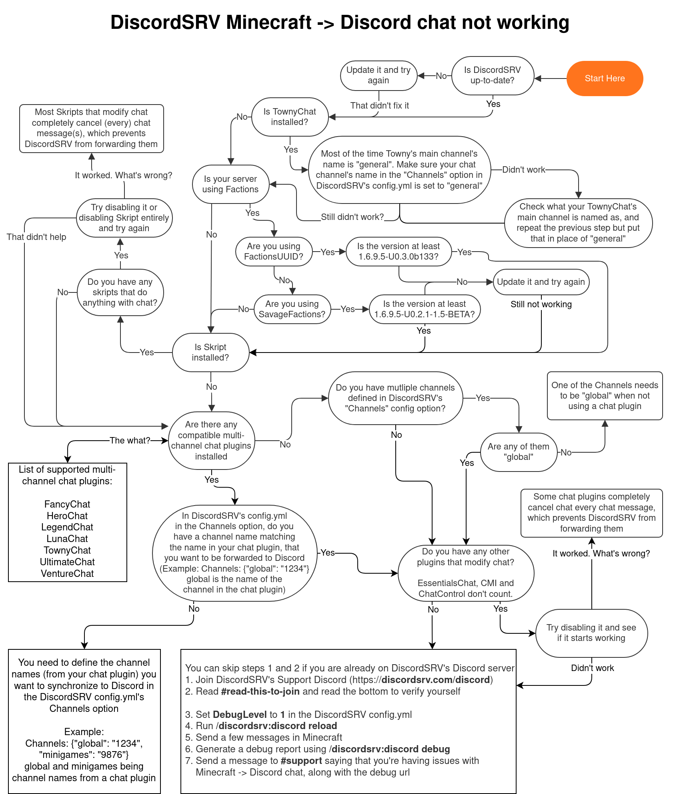
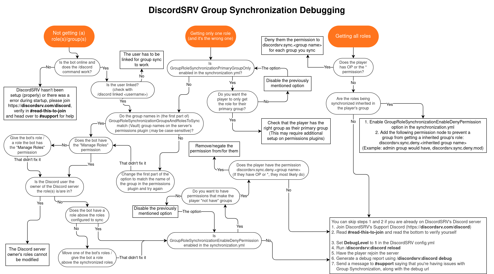

### Table of Contents

>* [Minecraft chat to Discord chat doesn't work](FAQ#Minecraft-chat-to-Discord-chat-doesnt-work)
>* [I need help with Minecraft to Discord Role synchronization](FAQ#Minecraft-to-Discord-Role-synchronization)
>* [How can I disable a feature/message?](FAQ#disable-a-featuremessage)  
>* [How can I change a notification message embed back to plain text?](FAQ#embed-back-to-plain-text)  
>* [Is DiscordSRV compatible with BungeeCord?](FAQ#is-discordsrv-compatible-with-bungeecord)
>* [Why won't messages send from Minecraft to Discord? I have TownyChat installed btw.](FAQ#messages-wont-send-townychat)  
>* [I reloaded the plugin/server and now it won't work.](FAQ#reloaded-the-pluginserver)  
>* [When I join/quit my server, a message isn't sent in the chat channel for me. What gives?](FAQ#when-i-joinquit-my-server-a-message-isnt-sent)  
>* [How do I fix the error "Unsupported major.minor version 52.0?"](FAQ#unsupported-majorminor-version)  
>* [The plugin crashes at serverstart reporting "java.lang.NoClassDefFoundError: com/scarsz/discordsrv/jda/managers/AccountManager"](FAQ#the-plugin-crashes-at-serverstart)  
>	* [Fix for Thermos, Cauldron and early KCauldron](FAQ#thermos-cauldron-and-early-kcauldron)  
>	* [Fix for KCauldron](FAQ#kcauldron)  
>* [Only show errors in console-channel](FAQ#Only-show-errors-in-console-channel)  
>* [Block special console-output from appearing in console-channel](FAQ#Block-special-console-output)  
>* [Can we op players from the discord console?](FAQ#op-players-discord-console)  
>* [Why can't I control my music bot from Minecraft?](FAQ#music-bot-from-minecraft)
>* [Where is the bot hosted?](FAQ#bot-hosted)
>* [Can I modify the bot using javascript?](FAQ#modify-bot-javascript)
>* [How can I show the player count in the game status?](FAQ#player-count-game-status)
>* [Why is the plugin red in the <code>/plugins</code> output?](FAQ#plugins-output-red)
>	* [Where can I find the server log?](FAQ#find-log)
>	* [What should I do with the server log?](FAQ#do-with-log)

<hr>

### Minecraft chat to Discord chat doesn't work


<hr>

<h3 id="Minecraft-to-Discord-Role-synchronization">I need help with Minecraft group <-> Discord Role synchronization</h3>  



<hr>

<h3 id="disable-a-featuremessage">How can I disable a feature/message?</h3>  

In most cases by clearing a value in the config. `option: ""`

For example:
```yaml
DiscordChatChannelServerStartupMessage: ":white_check_mark: **Server has started**"
```
would be
```yaml
DiscordChatChannelServerStartupMessage: ""
```

For format options with embeds, you just set `Enabled` to `false`

For example:
```diff
MinecraftPlayerLeaveMessage:
-  Enabled: true
  Webhook:
    Enable: false
    AvatarUrl: "%botavatarurl%"
    Name: "%botname%"
  Content: ""
  Embed:
    Enabled: true
    Color: "#ff0000"
    Author:
      ImageUrl: "%embedavatarurl%"
      Name: "%username% left the server"
      Url: ""
    ...
```
would be
```diff
MinecraftPlayerLeaveMessage:
+  Enabled: false
  Webhook:
    Enable: false
    AvatarUrl: "%botavatarurl%"
    Name: "%botname%"
  Content: ""
  Embed:
    Enabled: true
    Color: "#ff0000"
    Author:
      ImageUrl: "%embedavatarurl%"
      Name: "%username% left the server"
      Url: ""
    ...
```

<hr>

<h3 id="embed-back-to-plain-text">How can I change a notification message embed back to plain text?</h3>  

By moving the value in `Embed.Author.Name` to `Content` and setting `Embed.Enabled` to `false`

For example:
```diff
MinecraftPlayerLeaveMessage:
  Enabled: true
  Webhook:
    Enable: false
    AvatarUrl: "%botavatarurl%"
    Name: "%botname%"
-  Content: ""
  Embed:
-    Enabled: true
    Color: "#ff0000"
    Author:
      ImageUrl: "%embedavatarurl%"
-      Name: "%username% left the server"
      Url: ""
    ...
```
would be
```diff
MinecraftPlayerLeaveMessage:
  Enabled: false
  Webhook:
    Enable: false
    AvatarUrl: "%botavatarurl%"
    Name: "%botname%"
+  Content: "%username% left the server"
  Embed:
+    Enabled: false
    Color: "#ff0000"
    Author:
      ImageUrl: "%embedavatarurl%"
+      Name: ""
      Url: ""
    ...
```

<hr>

<h3 id="compatible-bungeecord">Is DiscordSRV compatible with BungeeCord?</h3>  

No, but you can install the plugin on every Bukkit server. (Do **not** use the same token for more than 1 server!)  
  
If you would like to have linked accounts shared across servers, you can connect your DiscordSRV instances to a MySQL database (`Experiment_Jdbc` options)  

<hr>

<h3 id="messages-wont-send-townychat">Why won't messages send from Minecraft to Discord? I have TownyChat installed btw.</h3>  

Towny's main channel's name is usually `general`, instead of DiscordSRV's default, `global`.  

<hr>

<h3 id="reloaded-the-pluginserver">I reloaded the plugin/server and now it won't work.</h3>  

Only reload the plugin using the plugin's specified reload command. (`/discordsrv reload`)
If that doesn't work, restart your server. Some changes need this for them to take effect.  

???+ note "Note"
    Plugins made specifically for reloading/stopping/starting plugins (and the built-in server `/reload` command) can make those plugins stop working properly.  

<hr>

<h3 id="when-i-joinquit-my-server-a-message-isnt-sent">When I join/quit my server, a message isn't sent in the chat channel for me. What gives?</h3>  

You have one of DiscordSRV's permissions to join/quit silently. To disallow this, give yourself or a group one of the following permissions depending on what you want to deactivate.
```yaml
groups:
  Owner:
    permissions:
    - -discordsrv.silentjoin
    - -discordsrv.silentquit
    - '*' #<-- "positive" permissions like this one should be AFTER the negated permissions
```  
<h3 id="unsupported-majorminor-version">How do I fix the error "Unsupported major.minor version 52.0?"</h3>

Update the server's Java JRE version to `Java 8` or contact your server provider and request an upgrade.  

<hr>

<h3 id="the-plugin-crashes-at-serverstart">The plugin crashes at serverstart reporting "java.lang.NoClassDefFoundError: com/scarsz/discordsrv/jda/managers/AccountManager"</h3>  

One of the libraries that DiscordSRV uses [[Reflections](https://github.com/ronmamo/reflections)] requires ASM **Version 5** to work. You're supposedly running a server with an old ASM version (i.e. 4.x) such as kCauldron / Thermos. Sadly this is a server software dependent problem and we are unable to fix it within DiscordSRV without violating plugin guidelines.  

<h4 id="thermos-cauldron-and-early-kcauldron"> Fix for Thermos, Cauldron and early KCauldron</h4>  

The SpecialSource library included with Thermos uses ASM4. Updating it to the latest version will fix the issue.  
Instructions for updating to ASM5:  
1. Navigate to the `libraries\net\md-5\SpecialSource\1.7-SNAPSHOT` folder of the server
2. Delete the SpecialSource-1.7-SNAPSHOT.jar file
3. Download SpecialSource v1.7.4 from https://repo1.maven.org/maven2/net/md-5/SpecialSource/1.7.4/SpecialSource-1.7.4.jar
4. Copy the jar file to the `libraries\net\md-5\SpecialSource\1.7-SNAPSHOT` folder
5. Rename the jar file you just copied to SpecialSource-1.7-SNAPSHOT.jar  

<h4 id="kcauldron">Fix for KCauldron</h4>  

The SpecialSource library included with KCauldron uses ASM4. Updating it to the latest version will fix the issue.  
Instructions for updating to ASM5:  
1. Navigate to the `bin\net\md-5\SpecialSource\1.7-SNAPSHOT` folder of the server  
2. Delete the SpecialSource-1.7-SNAPSHOT.jar file  
3. Download SpecialSource v1.7.4 from https://repo1.maven.org/maven2/net/md-5/SpecialSource/1.7.4/SpecialSource-1.7.4.jar
4. Copy the jar file to the `bin\net\md-5\SpecialSource\1.7-SNAPSHOT` folder  
5. Rename the jar file you just copied to SpecialSource-1.7-SNAPSHOT.jar  

***  

### Only show errors in console-channel  
If you want to use your console-channel to only inform you about problems, you can achieve that by using:
```yaml
DiscordConsoleChannelLevels: ["error"]
```  
***  

<h3 id="Block-special-console-output">Block special console-output from appearing in console-channel</h3>  

DiscordSRV allows you to hide phrases from appearing in console-channel. This can be achieved by making use of [regular expressions](https://en.wikipedia.org/wiki/Regular_expression).  
Some basic "placeholders" you have to know:  

*RegEx escaping must be done with `\\` instead of `\` in config files*  
Here are some examples to visualize how it works:  
#### Example 1: Block output of `/save-all`  
```css
 >> save-all
 [Mon, 20. Apr 2020 04:20:69 CDT INFO] Saving the game (this may take a moment!)
 [Mon, 20. Apr 2020 04:20:69 CDT INFO] Saved the game
```
```yaml
DiscordConsoleChannelFilters: {"^Saving\\.\\.\\.$|^Saved the game$": ""}
```  

```diff
 >> save-all
-[Mon, 20. Apr 2020 04:20:69 CDT INFO] Saving the game (this may take a moment!)
-[Mon, 20. Apr 2020 04:20:69 CDT INFO] Saved the game
```

#### Example 2: Hide lines which contain the string `The updater found an update:`  
```yaml
DiscordConsoleChannelFilters: {"^.*The updater found an update:.*$": ""}
```  
#### Example 3: Replace the ip address of those that join the game:  
```css
[Mon, 20. Apr 2020 04:20:69 CDT INFO] Scarsz[/192.168.1.2:58076] logged in with entity id 564875 at ([world]0.0, 0.0, 0.0)
```
```yaml
DiscordConsoleChannelFilters: {"\\[\\/[0-9]+\\.[0-9]+\\.[0-9]+\\.[0-9]+(?::[0-9]+)?\\]": ""}
```  
```css
[Mon, 20. Apr 2020 04:20:69 CDT INFO] Scarsz logged in with entity id 564875 at ([world]0.0, 0.0, 0.0)
```  

<h3 id="op-players-discord-console">Can we op players from the discord console?</h3>  

DiscordSRV by default blacklists the use of a handful of commands through the console channel. This is done through the [DiscordConsoleChannelBlacklistedCommands](https://config.discordsrv.com/config/DiscordConsoleChannelBlacklistedCommands) option. Remove the `"op"` option to allow the command to be used.
```yaml
# DiscordConsoleChannelBlacklistedCommands: phrases wrapped in quotation marks that users should not be able to send as commands to the console
...
DiscordConsoleChannelBlacklistedCommands: ["?", "op", "deop", "execute"]
```  
***  

<h3 id="music-bot-from-minecraft">Why can't I control my music bot from Minecraft?</h3>

It's bad practice for a bot to listen to another bot's messages. That's why most if not all public music bots can't be controlled through another bot.  

***  

<h3 id="bot-hosted">Where is the bot hosted?</h3>  

On the server that DiscordSRV is used on. The bot is online when the server is online.  

***  

<h3 id="modify-bot-javascript">Can I modify the bot using javascript?</h3>  

No. It's programmed in Java, not Javascript.  

***  

<h3 id="player-count-game-status">How can I show the player count in the game status?</h3>  

This can be done by using [PlaceholderAPI](https://www.spigotmc.org/resources/placeholderapi.6245/)'s `%playerlist_<type>,<subtype>,<include>,<output>,<subtype_value>%` placeholder in our [DiscordGameStatus](https://config.discordsrv.com/config/DiscordGameStatus) option.  

1. Make sure you have [PlaceholderAPI](https://www.spigotmc.org/resources/placeholderapi.6245/) installed.
2. Once the PlaceholderAPI plugin is loaded, run `/papi ecloud download PlayerList` to install the [PlayerList](https://github.com/PlaceholderAPI/PlaceholderAPI/wiki/Placeholders#playerlist) expansion.
3. Run `/papi reload` to reload the PlaceholderAPI expansions.
4. Read through the [PlayerList documentation](https://github.com/PlaceholderAPI/PlaceholderAPI/wiki/Placeholders#playerlist) on how to use the `%playerlist_<type>,<subtype>,<include>,<output>,<subtype_value>%` placeholder.
5. You can test the output of the placeholder using the `/papi parse me <placeholder>` command.


***  

<h3 id="plugins-output-red">Why is the plugin red in the <code>/plugins</code> output?</h3>

+------------------------+---------------------------+
| if the plugin is green | if the plugin is red      |
+========================+===========================+
| the plugin is working  | the plugin is not working |
+------------------------+---------------------------+ 

First thing you should do is check your <u>server logs</u>. If you need further help understanding the errors you can send a copy of what you find or the whole logfile in one of the support channels in our [discord server](https://discordsrv.com/discord).  

<h4 id="find-log">Where can I find the server log?</h4>  

Minecraft servers store their logs in `<server_directory>/logs/`. Search for a file explorer in your server's management interface and navigate to that directory. If you find a `logs` folder search for the `latest.log` file. Some providers have a separate page for logs and may hide the `logs` folder.  

On Aternos:  
• Go to https://aternos.org/log/.  

On Minehut and server.pro:  
• Go to the "files" tab in the left menu.  
• Navigate to the root directory of your server.  
• From there navigate to /logs/latest.log.  

<h4 id="do-with-log">What should I do with the server log?</h4>  

• First of all, read it! I mean, that's what you do all the time when you run a server, isn't it? Try to locate any errors that have anything to do with DiscordSRV. If you're having trouble scrolling through the file you can use `Ctrl+F` to search the file for the phrase "DiscordSRV". This will highlight all occurrences of "DiscordSRV" which will make locating the error less difficult.  
• If you got the `latest.log` file or created a `.txt` file with the necessary errors you can upload these in one of the support channels in our [discord server](https://discordsrv.com/discord).  
• If you have trouble downloading the log file, copy/paste the text to a paste service (like [GitHub Gist](https://gist.github.com)). Copy the link that it gives you and send it in one of the support channels in our [discord server](https://discordsrv.com/discord).  

***  