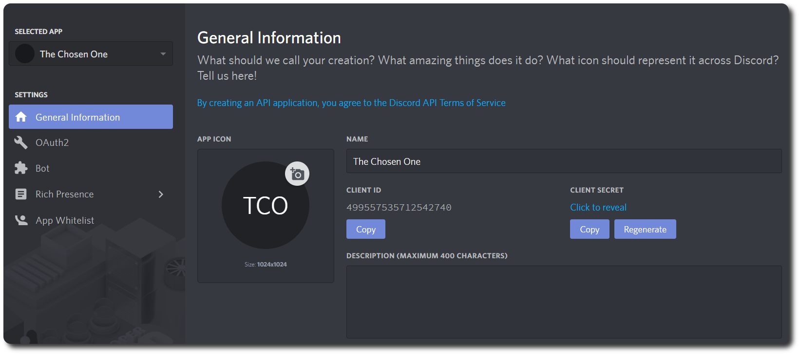
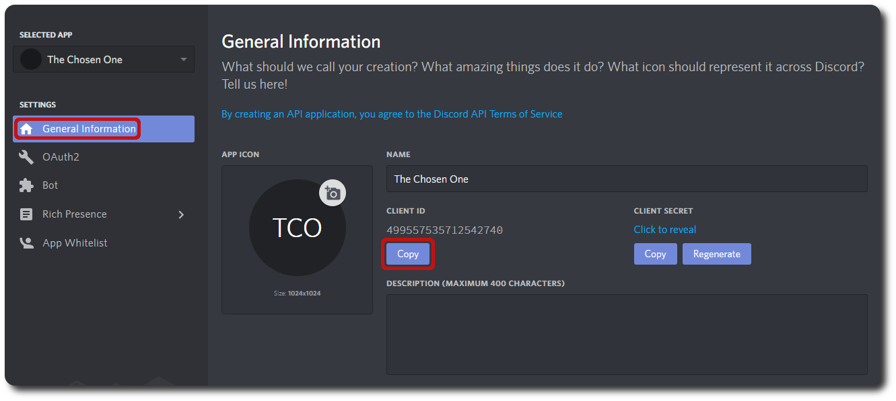
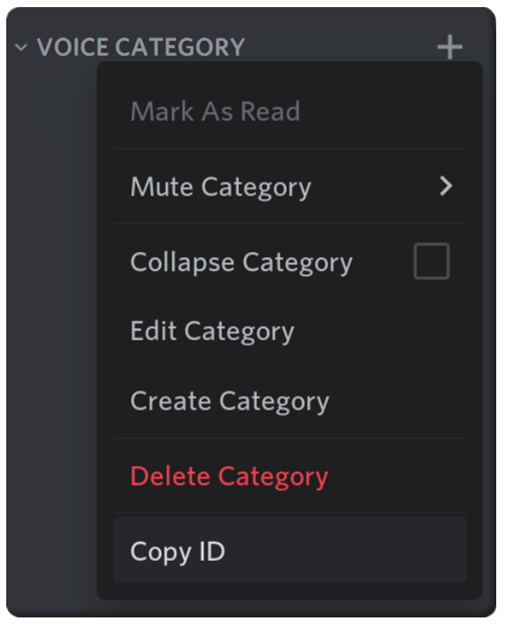

## Basic Installation

---

### Prerequisites

- server software based on the Bukkit API (CraftBukkit/Spigot/Paper/etc)
- ability to read server logs
- ability to modify server files

---

### Install the plugin

1. Put `DiscordSRV-Build-VERSION_NUMBER.jar` in the server's `plugins` folder and restart your server (This will generate a folder labeled `DiscordSRV` with all the config files)
1. Open the `config.yml` file in the `plugins/DiscordSRV/` folder with your favorite text editor

---

### Setting up the bot

#### Create the Application
!!! note "Create a new application at https://discord.com/developers/applications/ by clicking `"New Application"`"
      
#### Create the bot
!!! note "Choose a cool name for your bot and click `Create`"
    
#### Confirm the bot application
!!! note "Under the `Settings` tab, click `Bot`, then click `Add Bot` and confirm with `Yes, do it!`"
    
---

### Starting up the bot

#### Copy the bot token
!!! note "Copy the `Token` of the bot from the application page. Keep `PUBLIC BOT` unchecked so only you can invite the bot to the servers you designate."
    

---

#### Enable Server Members Intent
!!! note "Make sure to enable `SERVER MEMBERS INTENT` to avoid running into issues with DiscordSRV later on."
    

---

#### Paste the token into `config.yml`
```yaml
# config.yml Line 8
BotToken: "MjE5NTE5OTk0MDUxMDM1MTQ3.CqTCYw.SFAbKtfK3ydTy1jx2-fTHUJqsPo"
```  

---

#### Invite the bot to your guild

!!! note "Copy the `Client ID` from the application's `General Information` page."
      

Go to the following URL and paste your `Client ID` to the page (`Ctrl + V`): https://scarsz.me/authorize

??? hint "How does https://scarsz.me/authorize work?"
    It loads a small client-side running script which checks for a valid client ID length and redirects back to discord.com for OAuth 2 authorization of your bot. Alternatively, you can manually append the client ID to the end of the following link and open it:  
    `https://discordapp.com/oauth2/authorize?scope=bot+applications.commands&client_id=`

!!! note "Select your guild, then click `Authorize`"
    {width=325} 

---

#### Enable Developer Mode

!!! note "Go to your Discord settings by clicking on the cog on the bottom left of Discord."
      

!!! note "Go to the `Advanced` tab and enable `Developer Mode` (Outdated image)"
      

---

#### Set up a basic channel relay

!!! note "Right click the Discord-channel you want to use for chat between Discord and Minecraft and click on `Copy ID`"
      

Open the config.yml file again.  
Search for the option `Channels` and replace `000000000000000000` with the copied channel ID.
```yaml
# config.yml Line 14
Channels: {"global": "219559668236681216"}
```
_If you use a chat plugin with channel support like HeroChat, LegendChat, LunaChat, TownyChat or VentureChat, you can set up more channels here with their linked Discord channels. For example, if you want to add an "admin" channel it would look like this:_
```yaml
# config.yml Line 14
Channels: {"global": "219559668236681216", "admin": "221419146028646401"}
```
_Keep in mind that "admin" indicates an ingame channel, not a Discord channel name!_  
***  
**Optionally:**
Copy the Channel ID of a second Discord-channel for use as console-channel and paste it into `config.yml`
```yaml
# config.yml Line 17
DiscordConsoleChannelId: "219559838890459137"
```  

---

#### Give the bot the discord permissions it needs to run

!!! note "Open your server settings by clicking on the arrow to the right of the server name and choose `Server Settings`"
      

!!! note "Go to the `Roles` tab and create a new role. We've named ours `Bot`. Add the `Administrator` permission (or permissions listed below) to the new role."
      

---

!!! note "Switch to the `Members` tab and add the new `Bot` role to your bot by clicking on the `+` next to the bot's name and choosing the role."
      

(Re)start your server

**You're done with installing DiscordSRV!**

Now run through all the config options in [`config.yml`](https://config.discordsrv.com/config/_). You'll be surprised with how many features this plugin has

---

### Informations Avancées

#### Giving the bot the administrator permission

Usually it's not recommended to give the bot the Administrator permission, since it gives the bot complete control over your server. We recommend it because it makes the installation process easier on the server owner, and DiscordSRV doesn't do anything that would jeopardize the server. The only way this can be abused is by keeping the bot token secure.

If you don't feel comfortable with this, you can define the following permissions that the bot requires for certain features. This list can/will change and new permissions will need to be added for any new features that require them.
 
---

--8<-- "permissions.txt"

---

#### Role Hierarchy

Make sure the new Bot role is above any roles you want to synchronize using our role/nickname synchronization system (eg. if you want Moderators names to synchronize, you need to have the Bot role above the Moderator role)

---

## Group <-> Role Sync
 
***
**Please make sure to go through the [Basic Installation](Installation#Basic-Installation) before going through with this setup.**
***
 
### Get the name(s) of the minecraft group(s) you want to sync

the synchronization is case-sensitive so make sure you don't mess up with the capitalization

```yaml
# Example from generic permissions plugin
groups:
  MinecraftGroup1:
    permissions
    ...
  MinecraftGroup2:
    permissions
    ...
```

You can see what groups DiscordSRV can see in the `discordsrv-info.txt` file of debug reports, which can be accessed through the link generated from `/discordsrv debug`  

```yaml
# discordsrv-info.txt from debug report
vault groups: [default, MinecraftGroup1, MinecraftGroup2]
```  

---

### Get Role ID(s) for the role(s) you want to sync  

If you have `Developer Mode` enabled (see [Basic Installation](#basic-installation)), you can get the IDs from `Server Settings > Roles` by right-clicking the role(s)  

Role IDs are also in the `discordsrv-info.txt` file of debug reports, which can be accessed through the link generated from `/discordsrv debug`  

```C++
//discordsrv-info.txt from debug report
discord guild roles: [R:DiscordRole1(680679725206994947), R:DiscordRole2(680679790025506861)]
```

---

### Set the Role ID(s) and group name(s) in the synchronization option

Now that you have both the Role ID(s) and the Minecraft Group Name(s), add them into `GroupRoleSynchronizationGroupsAndRolesToSync` located inside the `synchronization.yml` config file.
```yaml
# synchronization.yml Line 27
 GroupRoleSynchronizationGroupsAndRolesToSync: {"MinecraftGroup1": "680679725206994947", "MinecraftGroup2": "680679790025506861"}
```

That's the basics of it! Read the comments for the other options in the `synchronization.yml` for more control over this system.

---

## Voice Setup

***
**Please make sure to go through the [Basic Installation](#basic-installation) before going through with this setup.**
***

Make sure `Voice enabled` is set to `true` in the `voice.yml` config

```yaml
# voice.yml Line 8
Voice enabled: true
```

!!! note "Create a category (name doesn't matter) where the voice module will create/delete/move voice channels"
    {width=325}

!!! note "Right click on the Category and select `Copy ID`"
    {width=325}

In the `voice.yml` config search for the `Voice category` option and replace `000000000000000000` with the copied Category ID.
```yaml
# voice.yml Line 13
Voice category: 000000000000000000
```

Create a channel (name doesn't matter) underneath the voice category you just made; This will be your "Lobby" voice channel.

!!! note "Right click on the Channel after moving it and select `Copy ID`"
    {width=325}

In the `voice.yml` config search for the `Lobby channel` option and replace `000000000000000000` with the copied Channel ID.
```yaml
# voice.yml Line 17
Lobby channel: 000000000000000000
```

(Re)start your server and you're done with configuring the voice module in DiscordSRV!


## Require Linking to Join Setup 

***
**Please make sure to go through the [Basic Installation](#basic-installation) before going through with this setup.**
***

This allows you to require the player have their discord account linked to their minecraft account before they can play on the server. When a player attempts to join, they get automatically kicked with a message saying that they need to message your DiscordSRV bot a code for them to be able to join.

Once the player is linked, more restrictions can be added, such as:

- The linked player must be in the discord server
- The linked player must have certain role[s] (this can be used to whitelist Twitch subscribers through the subscriber role if the user's twitch is linked to their discord account)

Make sure `Enabled` is set to `true` in the [`linking.yml`](../linking) config to enable this feature, then restart your server.
```yaml
# linking.yml Line 2
Enabled: true
```

Each option inside [`linking.yml`](../linking) is explained using comments, so read through them to get a better understanding of what you can do.
