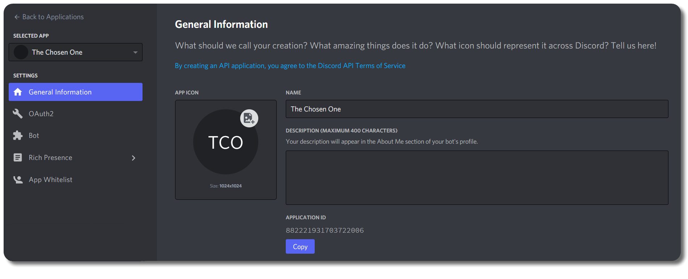

### Table of Contents

> * [Basic Installation](Installation#Basic-Installation)
> * [Group <-> Role Sync](Installation#Group---Role-Sync)
> * [Voice Setup](Installation#Voice-Setup)
> * [Linking Setup](Installation#Linking-Setup)


## Basic Installation

Create a new application at https://discord.com/developers/applications/ by clicking "New Application". Choose a cool name for your bot and click `Create`.  
>   
Under the `Settings` tab, click `Bot`, then click `Add Bot` and confirm with `Yes, do it!` 

> 
>   
***
**Optional**: The bot's avatar can be changed here
***  
Install the plugin by putting the DiscordSRV.jar in the `plugins` folder and restarting your server. Then open the configuration file which can be found in `plugins/DiscordSRV/config.yml`  
> Copy the `Token` of the bot from the application page. Keep `PUBLIC BOT` unchecked so only you can invite the bot to the servers you designate.
>   

> Make sure to enable `SERVER MEMBERS INTENT` to avoid running into issues with DiscordSRV later on.
> 

Paste it into the `config.yml`
```yaml
# config.yml Line 8
BotToken: "MjE5NTE5OTk0MDUxMDM1MTQ3.CqTCYw.SFAbKtfK3ydTy1jx2-fTHUJqsPo"
```  
> Copy the `Client ID` from the application's `General Information` page.  
>   
Go to the following URL and paste your `Client ID` to the page with `Ctrl + V`: https://scarsz.me/authorize  
*Hint: The page loads a small client side running script which checks for a valid client ID length and redirects back to discord.com for OAuth 2 authorization of your bot. Alternatively, you can manually append the client ID to the end of the following link and open it: `https://discord.com/oauth2/authorize?scope=bot&client_id=`*  

>Select your guild, then click `Authorize`  
  
Open Discord. Go to settings by clicking on the cog on the bottom left of Discord.  

>  
Go to the `Appearance` tab and enable `Developer Mode`  

>  
Right click the Discord-channel you want to use for chat between Discord and Minecraft and click on `Copy ID`  
  

Open the config.yml file again.  
Search for the option `Channels` and replace `000000000000000000` with the copied channel ID.
```yaml
# config.yml Line 14
Channels: {"global": "219559668236681216"}
```
_If you use a chat plugin with channel support like HeroChat, LegendChat, LunaChat, TownyChat or VentureChat, you can set up more channels here with their linked Discord channels. For example, if you want to add an "admin" channel it would look like this:_
```yaml
# config.yml Line 14
Channels: {"global": "219559668236681216", "admin": "221419146028646401"}
```
_Keep in mind that "admin" indicates an ingame channel, not a Discord channel name!_  
***  
**Optionally:**
Copy the Channel ID of a second Discord-channel for use as console-channel and paste it into `config.yml`
```yaml
# config.yml Line 17
DiscordConsoleChannelId: "219559838890459137"
```  
***  
> Open the Discord-server's settings by clicking on the 3 parallel lines right to the servername in the top left corner within Discord and choose `Server Settings`  
  

>Go to the `Roles` tab and create a new role `Bot`. Add the `Administrator` permission (or permissions listed below) to the new role.  
  
_Make sure the new Bot role is above any roles you want to synchronize using role/nickname synchronization (eg. if you want Moderators names to synchronize, you need to have the Bot role above the Moderator role)_  
  
_**For additional security:** you may also define the following permissions for the bot (__HOWEVER__, this list can/will change and new permissions will need to be added for any new features that require them)_ 
 
__Server Permissions__  
* `Manage Roles` - for [role synchronization](https://config.discordsrv.com/synchronization/GroupRoleSynchronizationGroupsAndRolesToSync) and [adding roles to linked players](https://config.discordsrv.com/config/MinecraftDiscordAccountLinkedRoleNameToAddUserTo)  
* `Manage Channels` - for [channel topic updater](https://config.discordsrv.com/messages/ChannelTopicUpdaterChatChannelTopicFormat)  
* `Ban Members` - for [ban synchronization](https://config.discordsrv.com/synchronization/BanSynchronizationDiscordToMinecraft)  
* `Manage Nicknames` - for [name synchronization](https://config.discordsrv.com/synchronization/NicknameSynchronizationEnabled)  
* `Manage Webhooks` - for [experimental webhook usage](https://config.discordsrv.com/config/Experiment_WebhookChatMessageDelivery) (Server-wide permission is _recommended_, but can be applied on a per-channel basis)  

__Channel Permissions__  
* `Read Text Channels & See Voice Channels` and `Send Messages` - Required in all of DiscordSRV's channels (including [console](https://pkrok.me/config/DiscordConsoleChannelId) and [voice lobby](https://config.discordsrv.com/voice/Lobby%20channel)), the [voice module category](https://config.discordsrv.com/voice/Voice%20category) and any other channels you want for [canned responses](https://config.discordsrv.com/config/DiscordCannedResponses)  
* `Manage Messages` - for message deletion features [playerlist](https://config.discordsrv.com/config/DiscordChatChannelListCommandEnabled), [chat channel commands](https://config.discordsrv.com/config/DiscordChatChannelConsoleCommandEnabled)  
* `Embed Links` - optionally for embedding ingame-posted links and required when embed messages are used [death](https://config.discordsrv.com/messages/MinecraftPlayerDeathMessage), [join/Leave](https://config.discordsrv.com/messages/MinecraftPlayerJoinMessage)  
* `Mention @everyone, @here and All Roles` - for mentioning @everyone if removed from [cut phrases in config.yml](https://config.discordsrv.com/config/DiscordChatChannelBlockedPhrases) and [mentions enabled](https://config.discordsrv.com/config/DiscordChatChannelTranslateMentions)  
* `Add Reactions` and `Read Message History` - for when the bot reacts with "💬" and "❗" to notify a [truncated message](https://config.discordsrv.com/config/DiscordChatChannelTruncateLength) is being sent from Discord to Minecraft  
* `Move Members` - required for the [voice lobby](https://config.discordsrv.com/voice/Lobby%20channel) and [voice category](https://config.discordsrv.com/voice/Voice%20category)
***  
(Re)start your server.  
> Switch to the `Members` tab and add the new `Bot` role to your bot by clicking on the `+` next to the bot's name and choosing the role.  
  

**You're done with installing DiscordSRV!**  
Now run through all the config's options in [`config.yml`](https://config.discordsrv.com/config/_). You'll be surprised with how many features this plugin has.


## Group <-> Role Sync
 
***
**Please make sure to go through the [Basic Installation](Installation#Basic-Installation) before going through with this setup.**
***
 
1. Get the group name(s) for the minecraft group(s) you want to sync
	- Keep in mind that it's case-sensitive  

```yaml
# Example from generic permissions plugin
groups:
  MinecraftGroup1:
    permissions
    ...
  MinecraftGroup2:
    permissions
    ...
```

2. Get Role ID(s) for the role(s) you want to sync  
	- If you have `Developer Mode` enabled (see [Basic Installation](Installation#Basic-Installation)), you can get the IDs from `Server Settings > Roles` by right-clicking the role(s)  
	- Role IDs are also in the `discordsrv-info.txt` file of debug reports, which can be accessed through the link generated from `/discordsrv debug`  

```C++
//discordsrv-info.txt from debug report
discord guild roles: [R:DiscordRole1(680679725206994947), R:DiscordRole2(680679790025506861)]
```  

Now that you have both the Role ID(s) and the Minecraft Group Name(s), add them into `GroupRoleSynchronizationGroupsAndRolesToSync` located inside the `synchronization.yml` config file.
```yaml
# synchronization.yml Line 27
 GroupRoleSynchronizationGroupsAndRolesToSync: {"MinecraftGroup1": "680679725206994947", "MinecraftGroup2": "680679790025506861"}
```

## Voice Setup

***
**Please make sure to go through the [Basic Installation](Installation#Basic-Installation) before going through with this setup.**
***

Make sure `Voice enabled` is set to `true` in the `voice.yml` config
```yaml
# voice.yml Line 8
Voice enabled: true
```
Create a category where the voice module will create/delete/move voice channels  
>   
**Note:** You can name this whatever you want.  


Right click on the Category and select `Copy ID`
> 

Open the voice.yml file.  
Search for the option `Voice category` and replace `000000000000000000` with the copied Category ID.
```yaml
# voice.yml Line 13
Voice category: 000000000000000000
```

Create a channel underneath that category; This will be your "Lobby" voice channel.
**Note:** You can name this whatever you want.

>Right click on the Channel after moving it and select `Copy ID`
> 

Open the voice.yml file again.  
Search for the option `Lobby channel` and replace `000000000000000000` with the copied Channel ID.
```yaml
# voice.yml Line 17
Lobby channel: 000000000000000000
```

**Restart your server and**
**You're done with configuring the voice module in DiscordSRV!**


## Linking Setup 

***
**Please make sure to go through the [Basic Installation](Installation#Basic-Installation) before going through with this setup.**
***

Make sure `Enabled` is set to `true` in the `linking.yml` config
```yaml
# linking.yml Line 2
Enabled: true
```


Read through the `linking.yml` config carefully. **TBC**  
